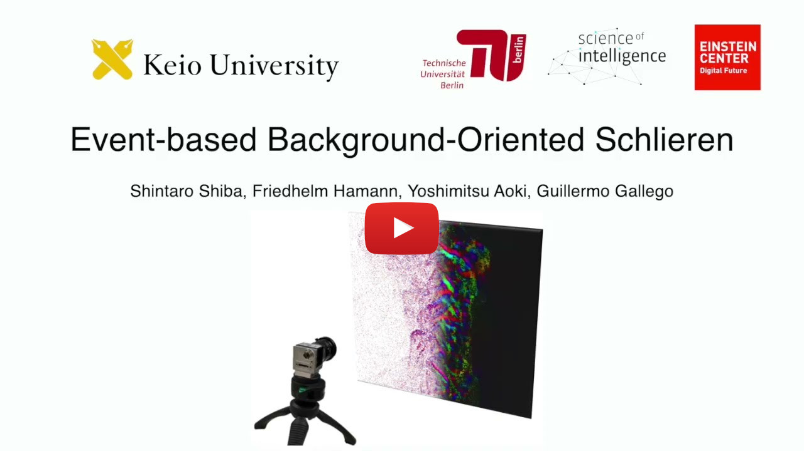

# Event-based Background-Oriented Schlieren

This is the official repository for **Event-based Background-Oriented Schlieren**, **IEEE T-PAMI 2023** by  
[Shintaro Shiba](http://shibashintaro.com/), [Friedhelm Hamann](https://friedhelmhamann.github.io/), [Yoshimitsu Aoki](https://aoki-medialab.jp/aokiyoshimitsu-en/) and [Guillermo Callego](https://sites.google.com/view/guillermogallego).


[[Video](https://youtu.be/v6ms6g2eOB8)] [[Dataset](https://drive.google.com/drive/folders/1kMnCKRI6QE8AmtxXe_jU9DTjlMbldpZM?usp=sharing)] [[PDF](https://ieeexplore.ieee.org/document/10301562/)]
 [[arXiv]()]

[](https://youtu.be/v6ms6g2eOB8)


If you use this work in your research, please cite it (see also [here](#citation)):

```bibtex
@Article{Shiba23pami,
  author        = {Shintaro Shiba and and Friedhelm Hamann and Yoshimitsu Aoki and Guillermo Gallego},
  title         = {Event-based Background-Oriented Schlieren},
  booktitle     = {IEEE Trans. Pattern Anal. Mach. Intell. (T-PAMI)},
  pages         = {},
  doi           = {10.1109/TPAMI.2023.3328188},
  year          = 2023
}
```

-------
# Setup

## Requirements

- python: 3.8.x, 3.9.x, 3.10.x

- [ffmpeg](https://ffmpeg.org/) ... This is necessary for `ffmpeg-python`.

### Tested environments

- Mac OS Monterey (both M1 and non-M1)
- Ubuntu (CUDA 11.1, 11.3, 11.8)
- PyTorch 1.9-1.12.1, or PyTorch 2.0.

## Installation

### Quick setup

Minimal quick setup is to use [venv](https://docs.python.org/3/library/venv.html).

```shell
python3 -m venv ~/work/venv
source ~/work/venv/bin/activate  # activate env
python3 -V  # make sure the version, 3.8 or higher
pip3 install scipy==1.9.1 optuna==2.10.1 opencv-python matplotlib plotly \
ffmpeg-python h5py hdf5plugin PyYAML Pillow sklearn scikit-image argparse openpiv \
torch torchvision black isort kaleido
```

### Full setup

You can use [poetry](https://python-poetry.org/docs/).

```shell
poetry install
```

This install dev dependencies (format, test) too.

## Download dataset

Please download the dataset and put into your local folder.
The structure of the folder is as follows:

```shell
(root)/datasets/
    CCS/   # fixed keyword: dataset recorded with the co-capture system (CCS).
        (sequence_name)/
            basler_0/
                frames.mp4          # frame data
                config.yaml
            prophesee_0/
                cd_events.raw       # event data in .raw format (Prophesee)
                events.hdf5         # event data converted in HDF5 format
                trigger_events.txt
            homography.txt          # calibration file
```

## EBOS dataset recorded with Co-Capture System (CCS)

The Prophesee camera provides `.raw` format file, which requires to install `OpenEB`.
We converted this file into hdf5 file formats for better compatibility among languages and OS.
So, there is no need to install OpenEB.

# Execution

## Run

An example is:

```shell
python3 bos_event.py --config_file ./configs/exp_table1/ours/73.yaml --eval
```

## Config

The configuration for each experiment is provided to the script through yaml files.

Please see the [readme](./configs/README.md).

## Development

Note you use poetry for development.

## Format

You can quickly run format of the codes:

```shell
make fmt
```

## Test

```shell
make test
```
<!--
# Citation

If you use this work in your research, please cite it as follows:

```bibtex
@Article{Shiba23pami,
  author        = {Shintaro Shiba and and Friedhelm Hamann and Yoshimitsu Aoki and Guillermo Gallego},
  title         = {Event-based Background-Oriented Schlieren},
  booktitle     = {IEEE T-PAMI},
  pages         = {},
  doi           = {10.1109/TPAMI.2023.3328188},
  year          = 2023
}
```
-->

# Code Authors

- [@shiba24](https://github.com/shiba24)
- [@FriedhelmHamann](https://github.com/FriedhelmHamann)

## LICENSE

Please check [License](./LICENSE).

## Acknowledgement

TBD

-------
# Additional Resources

* [Research page (TU Berlin, RIP lab)](https://sites.google.com/view/guillermogallego/research/event-based-vision)
* [Research page (Keio University, Aoki Media Lab)](https://aoki-medialab.jp/home-en/)
* [Course at TU Berlin](https://sites.google.com/view/guillermogallego/teaching/event-based-robot-vision)
* [Survey paper](http://rpg.ifi.uzh.ch/docs/EventVisionSurvey.pdf)
* [List of Resources](https://github.com/uzh-rpg/event-based_vision_resources)
